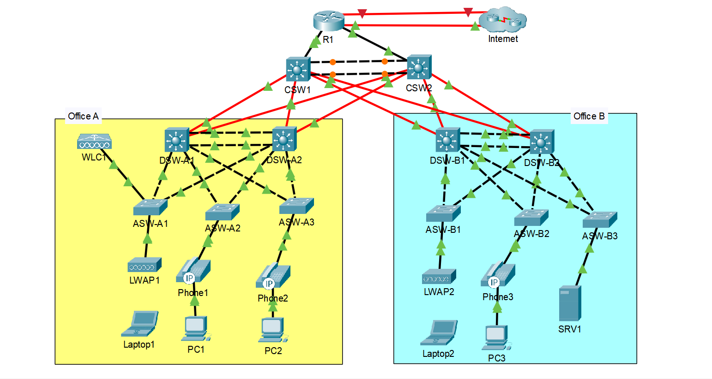

## CCNA Lab: Complete Network Configuration

This repository documents a comprehensive CCNA lab I completed, covering topics like IPv4/IPv6, VLANs, EtherChannel, OSPF, DHCP, NAT, security features, wireless, and more.  
The lab is based on a tutorial by [Jeremy’s IT Lab on YouTube](https://www.youtube.com/c/JeremysITLab). I recreated the lab in Packet Tracer for personal study and practice.

---

## 📡 Network Topology

Below is the network diagram for the lab, showing two offices (A and B) connected via core switches, with various devices including routers, switches, wireless controllers, and end devices.

---

## 🧪 Lab Overview

The lab is divided into 9 parts, each focusing on specific networking concepts. Below are the steps I followed and the CLI commands I used for each part.
